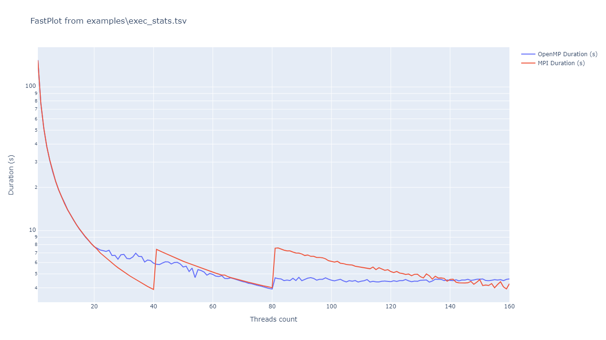
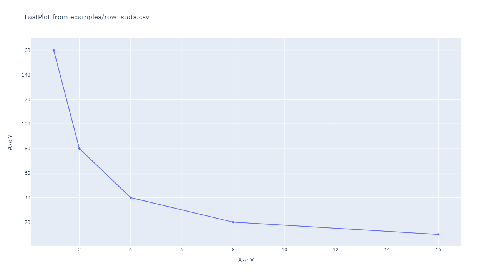

# FastPlot
FastPlot is a small python utility based on [Plotly](https://plotly.com/) for plotting data from a text file. 
By default, little to no arguments are needed in order to produce a plot, but this CLI allows you to 
customize the parsing of the input file and format of the output plot using many arguments.

## Table of contents
- [Installation](#installation)
- [Usage](#usage)
- [Limitations](#limitations)
- [Advanced usage](#advanced-usage)
  - [Output file](#output-file)
  - [Logarithmic scale](#logarithmic-scale)
  - [Axis titles and legend](#axis-titles-and-legend)
  - [Main axis](#main-axis)
  - [Miscellaneous](#miscellaneous)

## Installation
For now, this tool must be installed manually from this repo.
It is recommended to use [Pipenv](https://pipenv.pypa.io) to avoid dependency issues. 

First, you'll need to install pipenv with `pip install --user pipenv` *(more installation methods on their 
website)*, once you have pipenv, run `pipenv install` in FastPlot's directory. Note that this will put the
environment in a directory called `.virtualenvs` under your user's home directory. If you want to avoid that,
you can set the environment variable `PIPENV_VENV_IN_PROJECT=1` before running any pipenv-related command.

```
export ROOT_PM=`pwd`                # root of the repo
cd $ROOT_PM/script/fastplot/        # pipenv directory
export PIPENV_VENV_IN_PROJECT=1     # avoid creating .venv folder in your home directory
pipenv install                      # create .venv folder and dowload required packages
```


## Usage
> Disclaimer: This section covers usage of the tool through Pipenv, refer to 
> [installation section](#installation) for more information about Pipenv.


Once your Pipenv environment is set up and all dependencies installed into it, you can use two commands to run
FastPlot into the environment :

1. Usage 1

This allows you to use the pipenv environment from an other directory and run the script from the environment *(useful for aliases)* :

```
  export PIPENV_PIPFILE=$ROOT_PM/script/fastplot/Pipfile
  pipenv run python $ROOT_PM/script/fastplot/main.py  data.txt
``` 


2. Usage 2

This command opens a new shell session with some modified variables that allows you to run
python in this environment. Once you are in this new shell, you can use `python main.py` directly *(useful
for development)* :
```
  pipenv shell
  python $ROOT_PM/script/fastplot/main.py
```


##Options
You can then append command arguments after `main.py`, to a get the help message use `--help` argument.
The only required argument is the input file which can be any text file. By default, the program parses
the input file as a space-separated values files *(with skipping empty values)*, if the input file
is either a `.csv` or `.tsv` file the separator character is not a space but respectively a comma or
a tabulation. For the output plot, the program tries to open the plot into your browser (with an interactive
plot), if you're running this on a non-windowed system, the program falls back to a default output image 
placed next to your input file with the same name and the `.png` extension appended. If you only want to
output an image, use the `-o` argument with a path to the image.

This repository provides an `examples` directory with some usage examples. For example the following file
`examples/exec_stats.tsv`:
```
Threads count	OpenMP Duration (s)	MPI Duration (s)
01	154.10292	153.03909
02	77.12247	76.94257
03	51.40993	51.70887
04	38.56681	38.51279
05	30.85232	31.02685
06	25.66615	25.86048
[...]
```
You can try to build a plot from this file with the command line `python main.py examples/exec_stats.tsv`,
the result is shown below. As you can see, FastPlot has guessed axis titles and legends from the first line 
of the file. The first column (Threads count, 01, 02, 03, ...) is used for X values for subsequent data sets 
columns (OpenMP duration, MPI duration). The program has also guessed the title of the Y axis because 
data sets' titles ends with the string `Duration (s)`.


## Limitations
This tool aims simplicity, this implies the following limitations:
- You can only have one X and one Y axis.
- Only 2D line plot for now.
- Textual input file with predefined conventions.

## Advanced usage

### Output file
On a system without web browser, the default file path is just the input path with `.png` appended. Most
of the time it's enough but if you want to change this path or even the output file format, use the 
`-o <path>` *(`--output <path>`)*. Supported formats are `.png`, `.jpeg` (`.jpg`), `.svg`, `.pdf` and
`.html` (`.htm`).

For image formats (including PDFs and SVGs formats), you can append to the path the size of the image
using the format `?<width>x<height>`.

If you have a web browser, but you want to use the default path (with `.png` appended), use special empty
path *(`-o ""`)*.

> Note that the parents directories of the given output file path are created recursively if not existing.

### Logarithmic scale
Two arguments allows you to enable logarithmic scale for both X and Y axis, respectively `--xlog` and `--ylog`.
With the example from [usage section](#usage), using logarithmic scale for the Y axis will improve readability,
using `python main.py examples/exec_stats.tsv --ylog` output this:



### Axis titles and legend
By default, FastPlot read arrays' header and use them for title and legend of data sets. You can disable or
force enable this feature with the argument `--header {yes, no}`.
In addition to the header decoding, you can force the title of the two X and Y axis, using respectively 
`--xtitle <title>` and `--ytitle <title>`.

### Main axis
By default, your data arrays are expected to be in column, but the program can guess that your file has arrays
in lines if:
- The `--header` argument is not set to `no`, in this case this make no sense to guess headers.
- **And** the first line of the file is not composed only of text values.
- **And** the first column is composed only of text values.

You can also force FastPlot to use a specific axis with the `--axis {row, col}`.

For example the example file `examples/row_stats.csv` is 'in lines':
```
Axe X, 1, 2, 4, 8, 16
Axe Y, 160.0, 80.0, 40.0, 20.0, 10.0
```



### Miscellaneous
Some advanced arguments are not yet fully documented:
- `-s <sep1> [<sep2> [...]]` *(`--sep`)*, allows you to change separator chain used to split each line into values.
- `--strip {yes, no}`, enable or not stripping of values (removing leading and trailing spaces).
- `--skip-empty {yes, no}`, enable or not skipping of empty values, if yes, all empty values (after 
optional stripping) are discarded from the line.
- 