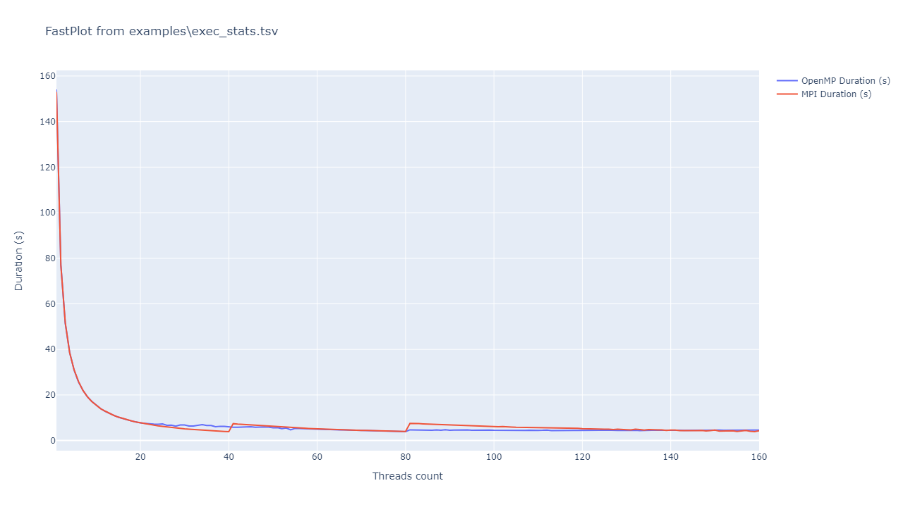

# FastPlot
FastPlot is a small python utility based on [Plotly](https://plotly.com/) for plotting data from a text file. 
By default, little to no arguments are needed in order to produce a plot, but this CLI allows you to 
customize the parsing of the input file and format of the output plot using many arguments.

## Table of contents
- [Installation](#installation)
- [Usage](#usage)

## Installation
For now, this tool must be installed manually from this repo.
It is recommended to use [Pipenv](https://pipenv.pypa.io) to avoid dependency issues. 

First, you'll need to install pipenv with `pip install --user pipenv` *(more installation methods on their 
website)*, once you have pipenv, run `pipenv install` in FastPlot's directory. Note that this will put the
environment in a directory called `.virtualenvs` under your user's home directory. If you want to avoid that,
you can set the environment variable `PIPENV_VENV_IN_PROJECT=1` before running any pipenv-related command.

## Usage
> Disclaimer: This section covers usage of the tool through Pipenv, refer to [installation section](#installation) 
> for more information about Pipenv.

Once your Pipenv environment is set up and all dependencies installed into it, you can use two commands to run
FastPlot into the environment:
- `pipenv run python main.py`, this directly runs the script into the environment *(useful for aliases)*.
- `pipenv shell`, this command opens a new shell session with some modified variables that allows you to run
python in this environment. Once you are in this new shell, you can use `python main.py` directly *(useful 
for development)*.

You can then append command arguments after `main.py`, to a get the help message use `--help` argument.
The only required argument is the input file which can be any text file. By default, the program parses
the input file as a space-separated values files *(with skipping empty values)*, if the input file
is either a `.csv` or `.tsv` file the separator character is not a space but respectively a comma or
a tabulation. For the output plot, the program tries to open the plot into your browser (with an interactive
plot), if you're running this on a non-windowed system, the program falls back to a default output image 
placed next to your input file with the same name and the `.png` extension appended. If you only want to
output an image, use the `-o` argument with a path to the image.

This repository provides an `examples` directory with some usage examples. You can try with the
`examples/exec_stats.tsv` file with the command line `python main.py examples/exec_stats.tsv`. As you can 
see below, the output plot has guessed axis titles and legend from the first line of the TSV *(this would 
be the same with a CSV)*.

Another simple example is with `examples/exec_stats_padded`, this file is just a space-separated variant
of the previous one *(with some variation in the data)*. With `python main.py examples/exec_stats_padded`,
you can see the following result.

